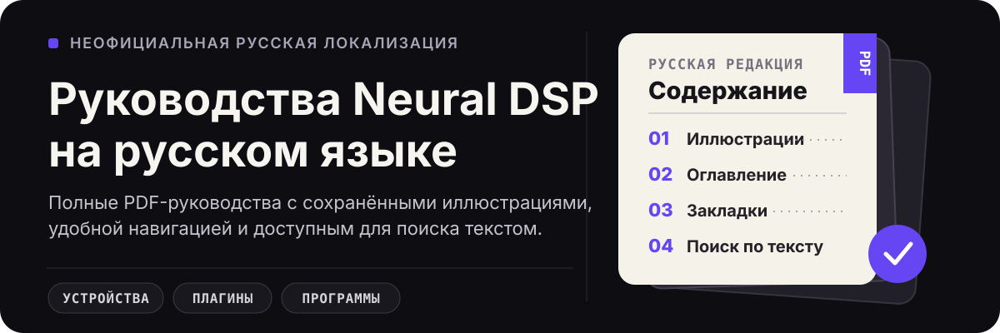

  

# Руководства Neural DSP на русском языке

В этом репозитории собраны **неофициальные русские переводы** руководств Neural DSP в формате PDF. Это единый каталог инструкций для устройств, плагинов и программ Neural DSP — без сокращений исходного материала и с удобной навигацией внутри документов.

Сейчас опубликованы полные русские версии руководств пользователя **Quad Cortex**, **Quad Cortex mini**, **Nano Cortex** и плагинов **Archetype: John Mayer X**, **Darkglass Ultimate** и **Mantra**. Остальные переводы будут добавляться по мере готовности.

**[Выбрать руководство](#доступные-руководства)** · **[Открыть все релизы](https://github.com/ialexbond/neuraldsp-manuals-ru/releases)** · **[Сообщить об ошибке](https://github.com/ialexbond/neuraldsp-manuals-ru/issues/new)**

> [!NOTE]
> Это независимый проект, не связанный с Neural DSP. Переводы не выдаются за официальные русские редакции производителя.

## Доступные руководства

Выберите продукт и откройте его актуальный релиз. Версия оригинала ведёт на официальное онлайн-руководство Neural DSP.

<!-- MANUAL_STATUS:START -->
| Категория | Продукт | Версия оригинала | Русская редакция | Статус | Релиз |
| --- | --- | --- | --- | --- | --- |
| Устройство | Quad Cortex | [4.0.0](https://neuraldsp.com/manual/quad-cortex) | 23.07.2026 | Опубликовано | [Открыть](https://github.com/ialexbond/neuraldsp-manuals-ru/releases/tag/quad-cortex-v4.0.0-ru.2026-07-23) |
| Устройство | Quad Cortex mini | [4.0.0](https://neuraldsp.com/manual/quad-cortex-mini) | 25.07.2026 | Опубликовано | [Открыть](https://github.com/ialexbond/neuraldsp-manuals-ru/releases/tag/quad-cortex-mini-v4.0.0-ru.2026-07-25) |
| Устройство | Nano Cortex | [2.2.0](https://neuraldsp.com/manual/nano-cortex) | 25.07.2026 | Опубликовано | [Открыть](https://github.com/ialexbond/neuraldsp-manuals-ru/releases/tag/nano-cortex-v2.2.0-ru.2026-07-25) |
| Плагин | Archetype: John Mayer X | [1.1.0](https://neuraldsp.com/manual/archetype-john-mayer-x) | 25.07.2026 | Опубликовано | [Открыть](https://github.com/ialexbond/neuraldsp-manuals-ru/releases/tag/archetype-john-mayer-x-v1.1.0-ru.2026-07-25) |
| Плагин | Darkglass Ultimate | [1.0.1](https://neuraldsp.com/manual/darkglass-ultimate) | 25.07.2026 | Опубликовано | [Открыть](https://github.com/ialexbond/neuraldsp-manuals-ru/releases/tag/darkglass-ultimate-v1.0.1-ru.2026-07-25) |
| Плагин | Mantra | [1.1.1](https://neuraldsp.com/manual/mantra) | 25.07.2026 | Опубликовано | [Открыть](https://github.com/ialexbond/neuraldsp-manuals-ru/releases/tag/mantra-v1.1.1-ru.2026-07-25) |
<!-- MANUAL_STATUS:END -->

## Что внутри каждого PDF

- полный русский текст без удаления разделов оригинала;
- оригинальные иллюстрации и схемы;
- кликабельное оглавление, закладки и внутренние ссылки;
- доступный для поиска и копирования текст;
- встроенные шрифты и единое оформление;
- понятное имя файла с версией оригинала и датой русской редакции.

Названия продуктов, элементов интерфейса, органов управления и разъёмов сохраняются там, где перевод мог бы помешать сопоставлению с устройством или приложением.

## Руководство Quad Cortex

Полный перевод руководства пользователя Quad Cortex охватывает подключение и настройку устройства, The Grid, пресеты и сцены, Directory, Neural Capture, импульсные отклики, совместимые плагины, MIDI, USB-аудио, Device Settings и Cortex Control.

Если вы ищете инструкцию, руководство пользователя или мануал Neural DSP Quad Cortex на русском языке:

**[Открыть актуальный релиз Quad Cortex →](https://github.com/ialexbond/neuraldsp-manuals-ru/releases/tag/quad-cortex-v4.0.0-ru.2026-07-23)**

## Руководство Quad Cortex mini

Русская инструкция Quad Cortex mini для CorOS 4.0.0 включает подключение и настройку, The Grid, страницы футсвитчей, пресеты и сцены, The Directory, Neural Capture, совместимость с плагинами, MIDI, USB-аудио, Device Settings и Cortex Control.

Если вам нужно полное руководство пользователя или мануал Neural DSP Quad Cortex mini на русском языке:

**[Открыть актуальный релиз Quad Cortex mini →](https://github.com/ialexbond/neuraldsp-manuals-ru/releases/tag/quad-cortex-mini-v4.0.0-ru.2026-07-25)**

## Руководство Nano Cortex

Русская инструкция Nano Cortex для NanOS 2.2.0 охватывает питание и подключение, рабочий режим, создание Neural Capture, загрузку импульсных откликов, эффекты, пресеты, тюнер, темп, Cortex Cloud, MIDI, USB-аудио, обновление прошивки и технические характеристики.

Если вам нужно полное руководство пользователя или мануал Neural DSP Nano Cortex на русском языке:

**[Открыть актуальный релиз Nano Cortex →](https://github.com/ialexbond/neuraldsp-manuals-ru/releases/tag/nano-cortex-v2.2.0-ru.2026-07-25)**

## Руководство Archetype: John Mayer X

Русская инструкция к плагину Neural DSP Archetype: John Mayer X 1.1.0 охватывает эффекты до усилителя, реверберацию и тремоло, усилитель, акустический кабинет, эквалайзер и компрессор, эффекты после усилителя, пресеты, тюнер, метроном, MIDI, установку, активацию лицензии и настройку плагина.

Если вам нужно полное руководство пользователя или мануал Neural DSP Archetype: John Mayer X на русском языке:

**[Открыть актуальный релиз Archetype: John Mayer X →](https://github.com/ialexbond/neuraldsp-manuals-ru/releases/tag/archetype-john-mayer-x-v1.1.0-ru.2026-07-25)**

## Руководство Darkglass Ultimate

Русская инструкция к плагину Neural DSP Darkglass Ultimate 1.0.1 охватывает Pre FX, Compressor, Octaver, Fuzz, Auto-Wah, Preamp, Cab, EQ Section, Graphic EQ, Chorus, Delay, Post FX, пресеты, тюнер, метроном, MIDI, установку, активацию лицензии и настройку плагина.

Если вам нужно полное руководство пользователя или мануал Neural DSP Darkglass Ultimate на русском языке:

**[Открыть актуальный релиз Darkglass Ultimate →](https://github.com/ialexbond/neuraldsp-manuals-ru/releases/tag/darkglass-ultimate-v1.0.1-ru.2026-07-25)**

## Руководство Mantra

Русская инструкция к плагину Neural DSP Mantra 1.1.1 охватывает модули Tune, Gate, Sculpt, De-Esser, EQ, Compressor, Saturation, Harmonies, Delay, Reverb, Modulation и Doubler, а также пресеты, MIDI, установку, активацию лицензии и настройку плагина.

Если вам нужно полное руководство пользователя или мануал Neural DSP Mantra на русском языке:

**[Открыть актуальный релиз Mantra →](https://github.com/ialexbond/neuraldsp-manuals-ru/releases/tag/mantra-v1.1.1-ru.2026-07-25)**

## Что публикуется в репозитории

- руководства для устройств Neural DSP;
- инструкции и справочные материалы для плагинов Neural DSP;
- руководства для программ Neural DSP;
- новые русские редакции при обновлении оригинальных материалов.

В каталог попадают только законченные переводы. Если руководства ещё нет в таблице, его русская версия пока не опубликована.

## Ошибки и предложения

Нашли неточность перевода, опечатку, неработающую ссылку или проблему с оформлением PDF? [Создайте сообщение об ошибке](https://github.com/ialexbond/neuraldsp-manuals-ru/issues/new) и укажите продукт, страницу и фрагмент текста.

Все опубликованные редакции и история выпусков доступны на [странице релизов](https://github.com/ialexbond/neuraldsp-manuals-ru/releases).
